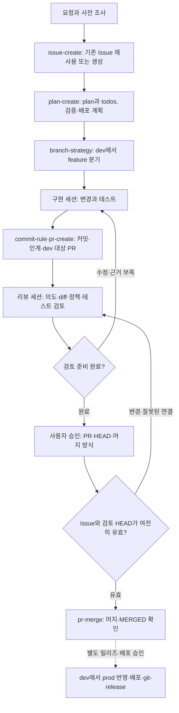

# git-workflow

변경 요청을 Issue의 의도·영향 범위·달성 조건으로 정리하고, 계획·구현·테스트·PR 검토·머지까지 같은 근거로 이어가는 Codex·Claude Code용 플러그인이다. 작업 기록은 docs/에 두고, 각 단계가 이전 단계의 의도와 실제 결과를 확인한다.

Issue → plan/todo → 구현·테스트·커밋 → PR → spec-it 검토 → 사용자 승인 → 머지로 연결한다.

| 스킬 | 역할 |
| --- | --- |
| git-workflow | 전체 단계 선택·공통 실행 경계·plan/todo 구현 조율 |
| issue-create | 기존 Issue 확인·생성/보완, 의도·영향·달성 조건 |
| plan-create | Issue 기반 계획·단위 todo·검증·배포/롤백 계획 |
| pr-create | 구현 후 PR 본문과 검토 인계 |
| pr-review | 사용자 의도·plan/todo·diff/commit·정책·테스트 증거 검토 |
| pr-merge | 승인된 HEAD의 머지와 실제 결과 확인 |
| commit-rule | 커밋 범위·메시지·index 보존 |
| branch-strategy | dev/feature/prod/hotfix 역할·분기·반영 규칙 |
| git-release | 태그·릴리즈·이력 기반 노트 |

[흐름도·사용 시나리오](#사용-시나리오), [필수 입력·양식](#스킬양식과-필수-입력), [로컬 시험](docs/examples/python-version-upgrade/local-pilot.md), [사용 시나리오](#사용-시나리오)를 참고한다. 상세와 양식의 정본은 각 스킬 references/에 있다. 기능·버그 Issue는 별도 템플릿을 사용한다. 공통 type·scope·문체는 git-workflow/references/에서 참조한다. 이동된 옛 파일과 안내용 별칭은 남기지 않는다.

## 작업 문서와 외부 기록

plan.md, todo, handoff.md, review.md의 위치는 [plan 경로 정본](skills/plan-create/references/plan.md#경로와-준비-조건)을 따른다. 계획에는 Issue 맥락·사용자 의도·단계 흐름·검증·배포/롤백을 기록한다. 구현 담당이 테스트 결과를 남기고 리뷰 담당이 의도·코드·근거를 대조한다.

PR 생성·머지 전에 본문의 Issue 항목을 실제 원격 Issue와 대조한다. PR 오연결·접근 불가·내용 불일치이면 보류하며 local-draft는 대신할 수 없다.

Issue/PR에는 전문을 복사하지 않고 핵심 결과·판단·남은 일과 확인된 문서 링크를 남긴다. 라벨은 저장소의 기존 분류를 우선하고 필요한 누락 라벨만 승인·권한 범위에서 생성한다. 전체 라벨 목록을 미리 만들지 않는다.

## 시험과 설치

0.2.0은 `feat/issue-review-workflow` 작업 브랜치에서 제공한다. 브랜치가 push된 뒤 [README의 브랜치 지정 명령](README.md#installation)으로 Codex·Claude에 설치한다. 기존 마켓플레이스가 있으면 등록된 ref와 설치 버전을 확인하고 해당 마켓플레이스·플러그인만 갱신한다. 기본 브랜치 반영은 머지 승인 후 별도 단계다. 새 세션에서 설치된 스킬을 확인하며, 미발행 로컬 변경 시험은 실제 소스 파일 경로를 지정한다.

현재 세션에서 단계별 실행할 수 있으며 별도 에이전트는 필수가 아니다. 스킬만으로 자동 트리거·강제 검증·무오류를 보장하지 않는다. commit·push·PR·머지·배포는 각각 요청된 범위에서 실행한다. 공유 계획은 docs/에, 임시 실행 자료는 git ignore된 .superpowers/에 둔다.

Wiki 작성은 추후 별도 스킬로 분리하며 현재 플러그인의 실행 범위에 포함하지 않는다.

## 사용 시나리오

아래는 요청과 예상 인계를 설명하는 가상 사례다. dmp.crawler의 실제 조사·테스트 결과가 아니다. [영문 시나리오](README.md#workflow-scenarios)도 같은 흐름을 설명한다. 모든 단계는 한 세션에서도 가능하다. 별도 세션·에이전트는 선택이며 사용자 또는 별도 구성한 실행기가 시작한다.



### 1. 파이썬 업그레이드 Issue 생성과 처리

> dmp.crawler 프로젝트 파이썬 버전 업그레이드가 필요해. 깃 이슈 생성(issue-create)하고 plan 생성(plan-create)하여 진행해줘.

1. 실제 리포의 현재 Python 실행 버전, 의존성 선언, 컨테이너·CI 설정, 테스트와 배포 진입점을 조사한다. 목표 버전과 중요한 호환성 결정을 확인한다. 변경 의도·영향 범위·달성 조건을 정리하고 issue-create로 같은 Issue를 재사용하거나 생성한다. Issue 전에는 사전 조사를 하고, 상세 구현 계획은 Issue 이후에 작성한다.
2. plan-create로 plan.md와 단위별 todos를 작성한다. 런타임·의존성 변경, 동작 회귀 사례, 단계별 검증, 배포 조건과 롤백을 포함한다. [채운 문서 세트](docs/examples/python-version-upgrade/README.md)는 가상 예시이며 실제 리포의 작업 경로는 [plan 정본](skills/plan-create/references/plan.md#경로와-준비-조건)을 따른다.
3. 구현 세션은 Issue·plan·todos를 읽고 branch-strategy로 확인한 dev에서 feature/python-version-upgrade를 만든다. 호환성·회귀 테스트를 작성하고 단위별 구현과 실제 결과를 기록한다. 요청된 커밋은 commit-rule로 처리하며 pr-create로 dev 대상 PR과 handoff.md를 준비한다.
4. 리뷰 세션은 pr-review로 Issue 의도·달성 조건, plan/todos, 실제 커밋·diff, 고정한 spec-it 규칙과 테스트 근거를 대조한다. review.md에 판단을 기록한다. 근거 부족이나 미결정이 있으면 구현 보완 또는 인간 판단으로 되돌린다.
5. 검토한 HEAD·위험·머지 방식을 제시한다. 사용자가 명시 승인한 후 pr-merge가 실제 Issue와 현재 HEAD를 재확인하고 같은 HEAD를 머지하여 MERGED와 mergeCommit을 확인한다. dev 통합만으로 운영 배포를 완료했다고 하지 않는다.

세션 인계 요청 예시:

```text
구현: Issue, plan.md와 단위별 todos를 읽어줘. branch-strategy로 분기하고
승인된 단위를 구현·테스트한 뒤 commit-rule로 커밋하고 pr-create로 PR을 만들어줘.
머지·배포는 하지 마.
리뷰: pr-review로 이 PR을 검토해줘. Issue·plan/todos·커밋/diff·고정 정책·
테스트 근거를 대조하고 발견 사항과 검토한 HEAD를 알려줘.
머지: 검토한 PR의 <HEAD>를 <머지 방식>으로 pr-merge에 따라 머지해줘.
```

Issue 생성·PR 게시·커밋은 요청된 행동과 실제 접근 권한을 확인해 진행한다. 처음 요청이 이후의 운영 배포까지 자동 승인하지는 않는다.

### 2. 기존 Issue를 다른 세션에서 재개

> Issue #123의 plan과 todos를 읽고 남은 작업을 진행해서 PR을 준비해줘.

대상 리포에서 #123이 실제 Issue인지 확인하고 연결 문서를 읽는다. git-workflow로 미완료 단계를 선택하며 같은 Issue를 중복 생성하지 않는다. 브랜치·HEAD·완료 표시와 실제 테스트 근거를 대조하고 필요한 오래된 검증을 다시 수행한다. 다음 세션에는 Issue·plan/todos·커밋·handoff·미결정을 전달한다. [예시](docs/examples/resume-existing-issue/README.md).

### 3. 리뷰 지적이나 HEAD 변경 후 재검토

> pr-review에서 업그레이드 회귀 테스트가 부족하다고 했어. 보완하고 다시 리뷰해줘.

구현 담당이 사례와 결과를 보완하고 커밋·PR 요약·문서 링크를 갱신한다. 리뷰 담당은 새 HEAD를 검토하고 새 결과를 기록한다. 이전 HEAD 승인은 새 HEAD 머지 승인이 아니다. Issue 누락·PR 오연결·접근 불가·내용 불일치이면 pr-merge가 보류한다. [예시](docs/examples/review-rework/README.md).

### 4. 운영 장애를 hotfix로 처리

> 운영 크롤러 시작 오류를 Issue와 hotfix 브랜치로 수정해줘.

장애 Issue를 재사용/생성하고 최소 수정·재현/회귀 테스트·배포·롤백을 계획한다. branch-strategy는 보통 prod에서 hotfix/crawler-startup을 만든다. 구현·테스트 후 prod 대상 PR을 만들고 pr-review와 사용자 승인을 거쳐 pr-merge를 수행한다. 배포는 별도 승인 범위에서 진행한다. prod 반영 후 같은 수정을 dev에 역반영하고 충돌·동작을 검증하여 해당 반영도 리뷰·승인·머지한다. 태그는 선택한 릴리즈 커밋에 남긴다. [예시](docs/examples/crawler-startup-hotfix/README.md).

### 5. dev 통합 내용을 운영 릴리즈

> dev에 통합된 변경으로 운영 릴리즈를 준비하고 릴리즈 노트를 작성해줘.

연결된 Issue와 승인된 릴리즈 범위를 확인하고 필요하면 릴리즈 Issue·계획을 만든다. dev → prod PR에 통합/회귀와 배포·롤백 근거를 연결하고 승인된 HEAD만 리뷰·머지한다. 배포는 실제 프로젝트의 트리거·권한을 따른다. git-release는 이전 릴리즈와 선택한 prod 커밋을 비교해 노트·태그·Release를 준비하며 발행은 승인된 범위에서 수행한다. 태그나 GitHub Release 생성만으로 실제 배포를 증명하지 않는다. [예시](docs/examples/production-release/README.md).

### 6. GitHub 접근 없이 로컬 초안만 준비

> 로컬 Issue 초안과 계획만 만들어줘. 게시·구현·커밋은 하지 마.

local-draft와 원격 미확인을 기록하며 번호·URL·테스트 성공을 만들지 않는다. 접근이 회복되면 기존 Issue를 먼저 조회하고 실제 Issue 재사용/생성 후 plan 정본에 따라 작업 경로와 링크를 갱신한다. 로컬 초안은 PR 생성·머지의 실제 Issue 조건을 대신하지 않는다. [읽기 전용 파일럿](docs/examples/python-version-upgrade/local-pilot.md).

### 7. 다른 세션의 변경을 보존하며 커밋

> 파이썬 업그레이드 변경만 커밋하고 다른 세션의 변경은 보존해줘.

staged·미커밋 변경을 확인하고 commit-rule을 적용한다. staged 여부는 작성자를 알려주지 않는다. 혼합·출처 불명 변경에는 [scope 절차](skills/commit-rule/references/scope.md)를 적용한다. 대상 AGENTS.md의 댓글 포함 규칙과 staged diff를 확인하고 승인된 범위만 커밋한 뒤 남은 변경을 보고한다. 커밋 요청은 push 승인으로 확대하지 않는다.

## 스킬·양식과 필수 입력

| 단계 | 필요한 근거와 결과 | 상세 정본 |
| --- | --- | --- |
| Issue | 의도·영향 범위·달성 조건, 실제 Issue 또는 명시한 로컬 초안 | [Issue](skills/issue-create/references/issue.md) |
| 계획 | Issue 맥락·현재 동작·단위 작업·검증·배포/롤백 계획 | [plan](skills/plan-create/references/plan.md), [todos](skills/plan-create/references/todos.md) |
| 구현·PR | 실제 변경·테스트 사례/결과·커밋·계획 이탈·실제 Issue 연결 | [PR](skills/pr-create/references/pr.md), [handoff](skills/pr-create/references/handoff.md) |
| 리뷰 | 검토 HEAD·의도/AC 대응·diff·고정 정책·테스트 근거 | [review](skills/pr-review/references/review.md) |
| 머지 | 유효한 Issue·동일 검토 HEAD·사용자 명시 승인·실제 머지 확인 | [pr-merge](skills/pr-merge/SKILL.md) |
| 릴리즈 | 이전/대상 커밋 범위·소비자 영향·발행 범위 | [릴리즈 노트](skills/git-release/references/release-notes.md) |

실행 규칙은 [공통 경계](skills/git-workflow/references/execution-boundaries.md), [Issue 연결](skills/git-workflow/references/issue-link.md), [문서 요약·링크](skills/git-workflow/references/document-links.md), [라벨](skills/git-workflow/references/labels.md)에 둔다. Issue/PR에는 핵심 결과와 접근 가능한 docs 링크를 남기며 전문을 복사하지 않는다.

## 예제·로컬 시험

| 예제 | 문서 세트와 흐름 |
| --- | --- |
| [파이썬 버전 업그레이드](docs/examples/python-version-upgrade/README.md) | Issue·plan·단위별 todos·handoff·PR·review |
| [기존 Issue 재개](docs/examples/resume-existing-issue/README.md) | 진행 상태와 근거를 확인해 새 세션으로 인계 |
| [리뷰 보완](docs/examples/review-rework/README.md) | 지적 수정과 새 HEAD 검토·승인 |
| [크롤러 시작 장애 hotfix](docs/examples/crawler-startup-hotfix/README.md) | prod 수정과 검증한 dev 역반영 |
| [운영 릴리즈](docs/examples/production-release/README.md) | dev → prod, 배포·릴리즈 근거 |
| [로컬 시험](docs/examples/python-version-upgrade/local-pilot.md) | 읽기 전용 조사 또는 로컬 초안 준비 |

[docs/examples/](docs/examples/README.md)는 Issue 주제별 가상 예제다. 패키지의 설명용 위치이며 대상 리포의 실제 작업 경로 규칙을 바꾸지 않는다. [로컬 시험](docs/examples/python-version-upgrade/local-pilot.md)은 소스 파일을 지정하는 요청을 제공한다. 미발행 후보는 새 세션에 실제 로컬 소스를 명시해야 한다. 구조 검사는 자동 스킬 선택·정책 판정 정확도·실제 원격 실행을 증명하지 않는다.

이번 예시 작성으로 실제 dmp.crawler 코드 변경·원격 Issue/PR·배포·릴리즈는 수행하지 않았다.
