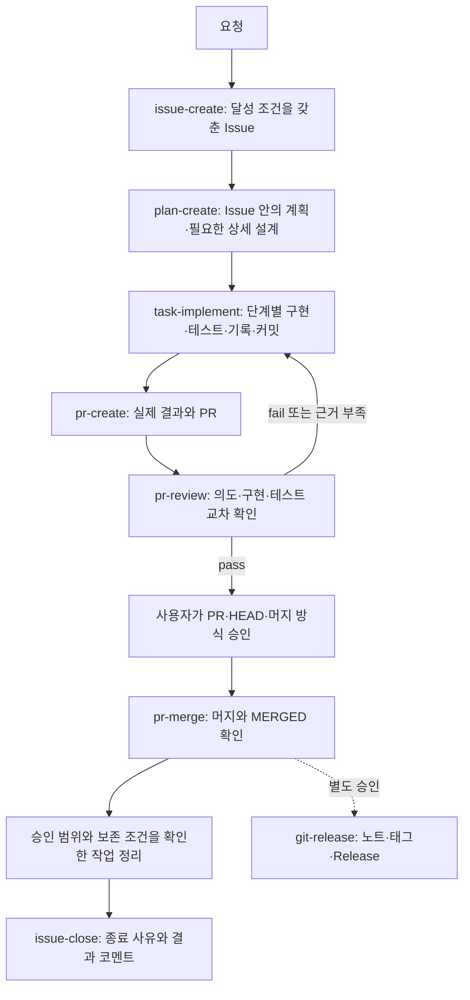

# git-workflow

**하나의 변경을 Issue의 의도부터 승인된 머지까지 같은 근거로 잇는다.**

[English](README.md) · **한국어**

git-workflow는 Issue 기반 변경을 위한 Codex·Claude Code 플러그인이다. 요청자가 원하는 결과를 Issue의 달성 조건으로 기록하고, Issue에 실행 계획을 작성하고, 그 ID를 구현·테스트·PR·검토까지 잇는다. 별도 작업 파일은 필요한 경우에만 만든다. 각 단계는 기억에 의존한 요약 대신 이전 단계의 의도와 실제 결과를 읽는다.

이 플러그인은 지시 모음이며 CI 서비스가 아니다. 한 chat에서 전체 흐름을 조정할 수 있다. 독립 검토 기준이나 입력을 작성·열람한 세션은 해당 변경을 구현하지 않으며 별도 구현 세션에 인계한다.

## 왜 쓰는가

- **의도와 근거가 이어진다** — Issue의 달성 조건 ID를 본문 계획, 테스트 사례, PR 결과와 검토가 참조한다.
- **검토가 빠진 테스트를 교차 확인한다** — pr-review는 달성 조건의 시나리오마다 구현과 assertion을 대응시키고, 테스트가 없는 시나리오를 보고한다.
- **위험한 단계마다 승인이 따로 있다** — 커밋·push·PR·머지·배포·릴리즈는 각각 다른 행동이며, 한 승인이 다른 행동이나 새 HEAD로 넘어가지 않는다.
- **대상 저장소가 같은 양식을 쓴다** — workflow-init이 스킬이 요구하는 항목을 갖춘 Issue·PR 템플릿을 설치한다.

## 다음 요청 선택

원하는 결과부터 요청한다. git-workflow는 Issue와 작업 기록을 읽고 다음 단계를 선택한다. 스킬을 직접 지정해도 된다.

| 현재 상황 | 요청 예시 | 스킬 |
| --- | --- | --- |
| 새 저장소 | “이 저장소에 Issue·PR 템플릿을 설치해줘.” | workflow-init: 템플릿 |
| 워크플로 채택 | “AGENTS.md에 git-workflow 채택 선언을 제안해줘.” | workflow-init: AGENTS.md; 추가 전 명시적 승인 |
| 새 변경 | “만료 안내는 유지하고 재시도 안내를 위한 Issue를 만들어줘.” | issue-create |
| 준비된 Issue | “Issue #12의 구현 계획을 작성해줘.” | plan-create |
| 준비된 단계 | “Issue #12의 01 단계를 구현하고 검증 결과를 기록해줘.” | task-implement |
| 구현 완료 | “Issue #12의 인계와 PR을 준비해줘.” | pr-create |
| 검토 필요 | “이 PR을 Issue·plan·실제 검증 근거와 대조해줘.” | pr-review |
| 검토된 HEAD | “승인된 PR을 합의한 방식으로 머지해줘.” | pr-merge; 해당 PR·HEAD에 대한 승인 |
| 작업 종료 | “확인된 결과와 종료 이유로 Issue #12를 닫아줘.” | issue-close; 종료·댓글의 별도 범위 |

범위를 정한 커밋은 commit-rule, 전략 초기화는 workflow-init, 릴리즈는 git-release에 요청한다. 일반 브랜치·PR·hotfix 작업은 [프로젝트 정책](skills/git-workflow/references/project-branch-policy.md)을 읽고 따른다. 각 요청이 다른 행동까지 자동 승인하지 않는다. 아래 스킬 표에서 정본 규칙을 읽는다.

Issue는 원문·동작 차이·영향·제약·AC·계획·필수 참고 링크, PR은 실제 결과·검증·배포 상태의 진입점이다. 단순 작업은 별도 파일 없이 진행한다. 상세 plan과 역할별 task는 필요한 경우에만 연결한다. 독립 검토 입력은 구현자에게 전달하지 않는다. [문서 역할과 인계](skills/git-workflow/references/document-links.md)를 참조한다.

## 작동 방식



정리는 원격 브랜치·로컬 브랜치·worktree 결과를 각각 보고한다. dirty·공유·잠금·보호·검토 후 작업은 보존하고 Codex 관리 worktree는 관리 기능으로 아카이브한다. [정리 정책](skills/pr-merge/references/post-merge-cleanup.md)을 적용한다. 종료 코멘트는 설치된 issue-close가 담당하며 없으면 로컬 handoff로 남긴다. 작은 후속 변경도 의도·범위·AC가 같은 열린 Issue만 재사용하고, 닫힌 범위와 다른 변경은 연결된 새 Issue로 추적한다.

| 스킬 | 쓰는 때 |
| --- | --- |
| [git-workflow](skills/git-workflow/SKILL.md) | Issue 기반 변경의 시작·재개와 다음 단계 선택 |
| [workflow-init](skills/workflow-init/SKILL.md) | 선택한 템플릿·AGENTS.md·라벨·릴리즈 분류·프로젝트 브랜치 전략 초기화 |
| [issue-create](skills/issue-create/SKILL.md) | Issue 작성·보완과 그 전의 중복 확인 |
| [plan-create](skills/plan-create/SKILL.md) | Issue 안의 계획과 조건부 상세 설계 작성 |
| [task-implement](skills/task-implement/SKILL.md) | 준비된 계획 구현, 검증, 결과 기록과 승인된 커밋 |
| [pr-create](skills/pr-create/SKILL.md) | AC별 구현·검증 결과와 PR 작성 |
| [pr-review](skills/pr-review/SKILL.md) | 변경이 Issue 의도를 채우는지와 빠진 테스트 확인 |
| [pr-merge](skills/pr-merge/SKILL.md) | 승인된 머지 확인·안전한 작업 정리·종료 근거 인계 |
| [issue-close](skills/issue-close/SKILL.md) | 종료 사유 선택과 결과 코멘트를 남기는 Issue 종료 |
| [commit-rule](skills/commit-rule/SKILL.md) | 주제별 커밋과 커밋 메시지 작성 |
| [git-release](skills/git-release/SKILL.md) | 릴리즈 노트·태그·GitHub Release 준비 |

단순 작업은 Issue·PR 본문을 기본 기록으로 사용한다. [상세 설계 조건](skills/plan-create/references/plan.md#상세-plan-생성-조건)에 해당할 때만 docs/git-workflows에 plan을 만들고 독립 계약이 필요한 task만 추가한다. handoff·review·evidence·txt는 자동 생성하지 않는다. [증거 수명과 문서 허브 인계](skills/git-workflow/references/document-links.md)를 따르며 기존 작업 파일·고정 링크는 보존한다. [짧은 예시](docs/examples/issue-centered-records/README.md)를 참조한다. 독립 기준은 구현 전 고정하고 [리뷰 전용 위치](skills/plan-create/references/review-criteria.md#보관-위치)에 유지한다.

## spec-it

[spec-it](https://github.com/insung/spec-it)은 프로젝트의 아키텍처·제품 정책을 고정하는 별도 플러그인이다. 프로젝트는 `.architecture/manifest.yaml`과 `.architecture/lock.yaml`을 커밋해 spec-it을 채택한다. git-workflow는 spec-it 없이도 동작한다.

| 프로젝트 상태 | pr-review 동작 |
| --- | --- |
| 채택(manifest·lock 있음) | 의도·구현·테스트 교차 확인 뒤 고정된 규칙으로 [spec-it 정책 검사](skills/pr-review/references/spec-it-policy.md)를 적용하고 규칙 ID별 판정을 기록 |
| 미채택 | 의도·구현·테스트 교차 확인만 하고 「spec-it 미채택」을 기록. 정책 판정 없음 |

## 설치

### Claude Code

```sh
claude plugin marketplace add insung/git-workflow
claude plugin install git-workflow@git-workflow
```

### Codex

```sh
codex plugin marketplace add insung/git-workflow
codex plugin add git-workflow@git-workflow
```

설치하거나 갱신한 뒤에는 새 세션을 시작한다. Claude Code에서는 스킬이 `/git-workflow:<스킬>`로 보인다.

### 대상 저장소 첫 실행

「git workflow 설치해줘」는 [workflow-init](skills/workflow-init/SKILL.md)으로 다섯 항목을 제시하고 선택을 기다린다. 「라벨만 설치해줘」 등 부분 요청은 해당 항목만 적용한다. 라벨은 기본 차이 미리보기와 승인된 누락 생성, release.yml은 기존 파일 보존을 따른다.

branch-strategy 스킬은 제거되었다. 이전 스킬 호출은 전략 기록이라면 workflow-init의 브랜치 전략 항목, 실제 브랜치 작업이라면 일반 요청과 공통 정책 읽기로 전환한다. 기존 프로젝트 정책 문서는 보존한다.

브랜치 전략도 독립 선택 항목이다. 기존 관행을 먼저 확인하고 GitHub Flow·Trunk·Release Flow·Gitflow·기존 dev/prod 후보에서 필요한 전략을 제안한다. 승인한 단일 프로젝트 문서에 기록하고 AGENTS.md에는 최소 읽기 연결을 제안한다. README 기존 내용 수정은 별도 승인하며, 적용 직전 파일이 바뀌면 재승인한다. 문서 생성만으로 AI 준수를 보장하지 않으며 일반 브랜치·PR·hotfix 요청으로 검증한다. [전략 초기화](skills/workflow-init/references/branch-policy.md)와 [후보·공식 출처](skills/workflow-init/references/branch-options.md)를 참고한다.

에이전트에게 GitHub 템플릿 설치를 요청한다. 예: 「이 저장소에 git-workflow의 Issue·PR 템플릿을 설치해줘」. workflow-init은 없는 파일만 복사하고 기존 템플릿과의 차이를 보고한다.

「이 프로젝트의 AGENTS.md를 git-workflow용으로 초기화해줘」라고 요청하면 [workflow-init](skills/workflow-init/SKILL.md)이 개별 프로젝트·다중 프로젝트 루트에 맞는 선언을 제안하고, 명시적 승인 후 기존 바이트를 보존하며 추가한다. 선언을 채택하면 메인이 승인된 단계를 조정하고 별도 구현자의 결과를 독립 검증한다. 전문은 스킬에서, 공통 맥락과 인계는 [역할별 읽기 순서](skills/git-workflow/references/document-links.md#문서별-역할과-읽기-순서)에서 확인한다.

## 구조

```text
skills/
├── git-workflow/      라우터, 실행 경계, 표기·문체, 라벨, 문서 링크
├── issue-create/      Issue 본문 규칙
├── plan-create/       본문 계획·선택적 설계 양식
├── task-implement/    계획 구현과 결과 기록 규칙
├── pr-create/         PR 규칙과 구현 인계 양식
├── pr-review/         검토 양식과 spec-it 정책 검사
├── pr-merge/          승인된 머지
├── issue-close/       종료 사유와 종료 코멘트 양식
├── commit-rule/       커밋 메시지·범위 규칙
├── git-release/       릴리즈 노트
└── workflow-init/     선택 설치·정본 자산·라벨 도구
```

규칙마다 정본 파일은 하나다. SKILL.md는 reference를 다시 쓰지 않고 링크한다.

## 개발

요구 사항: Node.js 18 이상. 의존성 없음.

```sh
node --test tests/package.test.mjs
node scripts/check-package.mjs
claude plugin validate .claude-plugin/plugin.json
claude plugin validate .claude-plugin/marketplace.json
git diff --check
```

이 검사는 패키지 구조, 매니페스트, 필수 파일, 상대 링크를 확인한다. 스킬 선택이나 검토 품질은 측정하지 않는다. 스킬 변경은 시나리오의 변경 전·후 비교로 확인하며, 실행 주체는 [검증 실행 주체](skills/git-workflow/references/execution-boundaries.md#검증-실행-주체)를 따른다.

## 예제

[문서 개선 전후](docs/examples/readable-records/README.md)는 의미를 보존하며 결론과 다음 행동을 쉽게 찾는 편집 예시다.

[예제](docs/examples/README.md)는 채운 문서 세트와 흐름을 보여준다.

| 예제 | 흐름 |
| --- | --- |
| [git-workflow v0.3.0 개선 (실제 사례)](docs/examples/git-workflow-v0.3.0/README.md) | 리뷰, Issue, 계획과 코멘트, 검토 기준 고정, 구현 세션 분리, 독립 검토, 머지와 릴리즈 |
| [파이썬 버전 업그레이드](docs/examples/python-version-upgrade/README.md) | Issue, plan, 단계별 todo, 구현 인계, PR, 검토 |
| [기존 Issue 재개](docs/examples/resume-existing-issue/README.md) | 다른 세션의 작업을 문서에서 이어받음 |
| [리뷰 보완](docs/examples/review-rework/README.md) | 검토 지적 수정과 새 HEAD 검토 |
| [크롤러 시작 장애 hotfix](docs/examples/crawler-startup-hotfix/README.md) | prod에서 수정하고 dev에 역반영 |
| [운영 릴리즈](docs/examples/production-release/README.md) | dev → prod, 배포와 릴리즈 노트 |
| [로컬 파일럿](docs/examples/python-version-upgrade/local-pilot.md) | GitHub 접근 없이 문서 준비 |

## 라이선스

[MIT](LICENSE)
