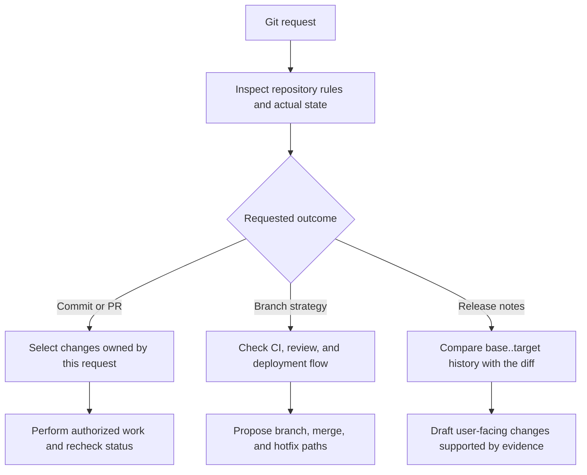

# git-workflow

[한국어](README.ko.md) · [MIT License](LICENSE)

A skill for carrying Git changes from a working tree to a reviewable commit, branch, PR, or release note. It checks the repository's actual state before recommending a delivery action. The same `skills/git-workflow/` directory is packaged for Codex and Claude Code.

## Why this exists

Git work often spans more than `git commit`: a working tree may contain another person's changes, a branch name may not describe the actual release path, and a list of commit subjects may not reflect what shipped. This skill gives an agent a repeatable way to establish scope and evidence before it describes or changes Git history. That problem statement is inferred from the skill's current rules; it is not a claim about the original author's private motivation.

It is useful when you want to:

- separate this request's changes from unrelated dirty files before committing;
- choose a branch and merge approach based on the repository's actual review and deployment flow;
- draft an issue or PR from known changes and verification evidence;
- decide whether a tag or release action fits the repository's existing conventions;
- produce release notes from a fixed `base..target` commit range and the actual diff.

## Install as a plugin

The plugin and marketplace both have the name `git-workflow`. This GitHub repository supplies the complete package; no `ai-workflow` checkout is required.

### Codex

```bash
codex plugin marketplace add insung/git-workflow
codex plugin add git-workflow@git-workflow
```

Start a new Codex task if the skill does not appear immediately. Invoke it with `$git-workflow`, or describe a Git delivery task that matches the skill.

### Claude Code

```bash
claude plugin marketplace add insung/git-workflow
claude plugin install git-workflow@git-workflow
```

Start a new Claude Code session if needed. Invoke the packaged skill as `/git-workflow:git-workflow`.

The package uses a portable root `plugin.json`, a Codex compatibility manifest and marketplace, and Claude Code plugin and marketplace manifests. All of them load the same [`skills/git-workflow/`](skills/git-workflow/) files.

## Use it

**A scoped commit**

```text
$git-workflow
Inspect the current working tree, separate my changes from other work,
then commit only the changes from this request in coherent groups.
```

The skill starts by checking repository status and the recent commit convention. It proposes or uses an authorized commit scope, stages only owned files or hunks, commits, then checks status again. A commit instruction does not by itself authorize a push.

**Branch strategy**

```text
$git-workflow
Review this repository's current branches, CI, release cadence, and review path.
Recommend a branch strategy and explain how a hotfix returns to the main line.
```

The answer should describe branch roles, branch and merge points, release baseline, protection rules, emergency fixes, and migration cost. A branch name alone is not evidence of its deployment role. The skill does not create or alter branches merely because you asked for a strategy.

**Release notes from history**

```text
$git-workflow
Draft release notes for the changes between v1.4.0 and the current main commit.
Include only user-visible or operational changes supported by the diff.
```

The skill checks that the base is an ancestor of the target, reads first-parent history and full commit bodies, and compares the actual changed files. It groups related changes and distinguishes a draft from a published release. When no previous release point is known, it can draft an `Unreleased` section without inventing a version or date.

## See the workflow



For example, suppose you explicitly identify `src/retry.ts` and `tests/retry.test.ts` as this request's changes, while `docs/team-plan.md` belongs to another task:

```text
 M src/retry.ts
 M tests/retry.test.ts
 M docs/team-plan.md
```

After reviewing the diffs and obtaining the applicable commit approval, the agent stages only the two retry files, checks the staged diff, runs the repository's relevant verification, and makes a scoped commit. A final `git status --short` should still show `docs/team-plan.md`. If ownership is unclear or changes share a file, the agent resolves the exact hunks before staging. This is an illustrative scenario, not a claim about this repository's working tree.

The installed skill includes [worked examples](skills/git-workflow/references/examples.md) for this commit case, a branch-strategy decision, and a release-note draft.

## Boundaries

The skill respects repository-specific instructions over its suggested commit format and branch defaults. It does not infer ownership of unrelated dirty changes, invent an issue number, claim tests or deployment that did not happen, or publish a release from commit subjects alone. A request for notes does not authorize a tag or GitHub Release. Push, PR, issue, merge, tag, and release actions each require the authorization applicable to that action.

This is workflow guidance, not a Git hook or policy enforcement engine. Projects that use spec-it can apply their own pinned policy independently; this skill does not copy or replace that policy.

## Package and updates

The canonical skill is [`skills/git-workflow/SKILL.md`](skills/git-workflow/SKILL.md). Branch and release-note detail lives in its linked `references/` files. The public plugin version is `0.1.0`; maintainers must update the version consistently in the plugin manifests when shipping a new plugin version.

To refresh a Codex Git marketplace and reinstall the plugin:

```bash
codex plugin marketplace upgrade git-workflow
codex plugin remove git-workflow@git-workflow
codex plugin add git-workflow@git-workflow
```

For Claude Code:

```bash
claude plugin marketplace update git-workflow
claude plugin update git-workflow@git-workflow
```

To stop using the plugin, run `codex plugin remove git-workflow@git-workflow` or `claude plugin uninstall git-workflow@git-workflow` in the corresponding host.
