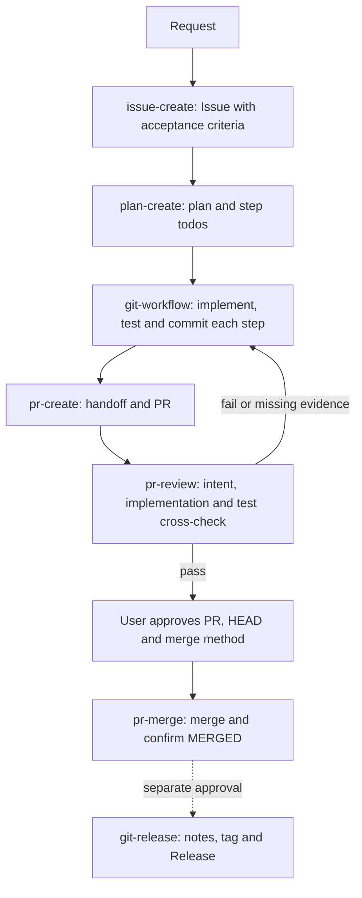

# git-workflow

**Carry one change from Issue intent to an approved merge on the same evidence.**

**English** · [한국어](README.ko.md)

git-workflow is a Codex and Claude Code plugin for Issue-based changes. It records what the requester wants as Issue acceptance criteria, splits the work into a plan and step todos, and carries those IDs through implementation, tests, the PR and review. Each stage reads the previous stage's intent and actual results instead of a summary from memory.

The plugin is a set of instructions, not a CI service. One session can run every stage; separate sessions are optional.

## Why

- **Intent and evidence stay connected** — acceptance criteria IDs from the Issue are referenced by todos, test cases, the handoff and the review.
- **Reviews cross-check for missing tests** — pr-review maps every acceptance scenario to its implementation and its assertion, and reports scenarios with no test.
- **Each risky step has its own approval** — commit, push, PR, merge, deployment and release are separate actions; approval for one does not extend to another or to a new HEAD.
- **Target repositories use the same forms** — template-init installs Issue and PR templates that contain the fields the skills require.

## How it works


```mermaid
flowchart TD
    A[Request] --> B[issue-create: Issue with acceptance criteria]
    B --> C[plan-create: plan and step todos]
    C --> D[git-workflow: implement, test and commit each step]
    D --> E[pr-create: handoff and PR]
    E --> F[pr-review: intent, implementation and test cross-check]
    F -->|fail or missing evidence| D
    F -->|pass| G[User approves PR, HEAD and merge method]
    G --> H[pr-merge: merge and confirm MERGED]
    H -. separate approval .-> I[git-release: notes, tag and Release]
```

| Skill | Use it to |
| --- | --- |
| [git-workflow](skills/git-workflow/SKILL.md) | Start or resume an Issue-based change, choose the next stage, implement a prepared plan |
| [issue-create](skills/issue-create/SKILL.md) | Write or complete an Issue, check for duplicates first |
| [plan-create](skills/plan-create/SKILL.md) | Write the plan and step todos for an Issue |
| [pr-create](skills/pr-create/SKILL.md) | Write the implementation handoff and open the PR |
| [pr-review](skills/pr-review/SKILL.md) | Check that the change meets the Issue intent and that no test is missing |
| [pr-merge](skills/pr-merge/SKILL.md) | Merge the reviewed HEAD after user approval and confirm the result |
| [commit-rule](skills/commit-rule/SKILL.md) | Make scoped commits and write commit messages |
| [branch-strategy](skills/branch-strategy/SKILL.md) | Define branch roles or create a branch |
| [git-release](skills/git-release/SKILL.md) | Prepare release notes, tags and GitHub Releases |
| [template-init](skills/template-init/SKILL.md) | Install the Issue and PR templates into a target repository |

Work documents (plan.md, `task-{nn}-{step-title}.md`, handoff.md, review.md) live in the target repository under the [directory rules](skills/plan-create/references/plan.md#디렉토리-규칙).

## spec-it

[spec-it](https://github.com/insung/spec-it) is a separate plugin that pins a project's architecture and product policies. A project adopts it by committing `.architecture/manifest.yaml` and `.architecture/lock.yaml`. git-workflow does not require spec-it.

| Project state | pr-review behavior |
| --- | --- |
| Adopted (manifest and lock present) | Runs the intent, implementation and test cross-check, then applies the [spec-it policy check](skills/pr-review/references/spec-it-policy.md) against the pinned rules and records verdicts by rule ID |
| Not adopted | Runs the intent, implementation and test cross-check only, records "spec-it not adopted", and makes no policy verdict |

## Installation

### Claude Code

```sh
claude plugin marketplace add insung/git-workflow
claude plugin install git-workflow@git-workflow
```

### Codex

```sh
codex plugin marketplace add insung/git-workflow
codex plugin add git-workflow@git-workflow
```

Start a new session after installing or updating. In Claude Code the skills appear as `/git-workflow:<skill>`.

### First run in a target repository

Ask the agent to install the GitHub templates, for example "Install the git-workflow Issue and PR templates in this repository". template-init copies only the files that do not exist yet and reports how existing templates differ.

## Architecture

```text
skills/
├── git-workflow/      router, execution boundaries, conventions, labels, links
├── issue-create/      Issue content rules
├── plan-create/       plan and todo forms
├── pr-create/         PR rules and handoff form
├── pr-review/         review form and spec-it policy check
├── pr-merge/          approved merge
├── commit-rule/       commit message and scope rules
├── branch-strategy/   branch roles and creation
├── git-release/       release notes
└── template-init/     assets/.github/ Issue and PR templates
```

Each rule has one canonical file. SKILL.md files link to their references instead of repeating them.

## Development

Requirements: Node.js 18 or newer. No dependencies.

```sh
node --test tests/package.test.mjs
node scripts/check-package.mjs
claude plugin validate .claude-plugin/plugin.json
claude plugin validate .claude-plugin/marketplace.json
git diff --check
```

These checks cover package structure, manifests, required files and relative links. They do not measure skill selection or review quality; skill changes are checked with before-and-after subagent scenarios recorded in the work documents.

## Examples

The [examples](docs/examples/README.md) show filled document sets and flows.

| Example | Flow |
| --- | --- |
| [Python version upgrade](docs/examples/python-version-upgrade/README.md) | Issue, plan, step todos, handoff, PR and review |
| [Resume an existing Issue](docs/examples/resume-existing-issue/README.md) | Continue another session's work from its documents |
| [Review rework](docs/examples/review-rework/README.md) | Fix review findings and review the new HEAD |
| [Crawler startup hotfix](docs/examples/crawler-startup-hotfix/README.md) | Fix from prod and reflect the fix into dev |
| [Production release](docs/examples/production-release/README.md) | dev to prod, deployment and release notes |
| [Local pilot](docs/examples/python-version-upgrade/local-pilot.md) | Prepare documents without GitHub access |

## License

[MIT](LICENSE)
