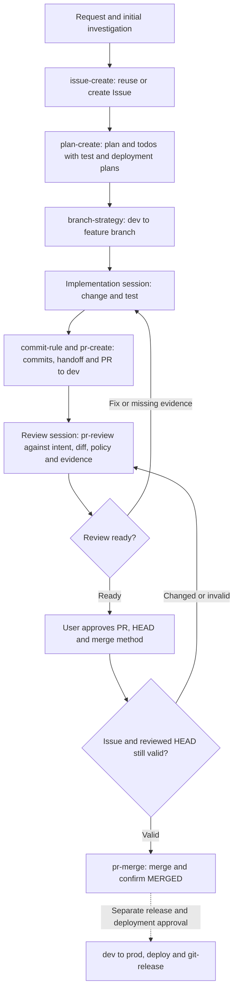

# git-workflow

A Codex and Claude Code plugin that connects Issue intent, scope and acceptance criteria to plans, implementation evidence, PR review and approved delivery.

Issue → plan/todos → implementation, tests and scoped commits → PR → spec-it review → approved merge.

| Skill | Responsibility |
| --- | --- |
| git-workflow | Stage routing, shared boundaries, plan/todo implementation |
| issue-create | Reuse/create or complete the Issue intent, scope and acceptance criteria |
| plan-create | Write the Issue-based plan, verification/deployment plans and task todos |
| pr-create | Prepare the implemented change and its PR/review handoff |
| pr-review | Review intent, plan/todos, diff/commits, pinned policy and test evidence |
| pr-merge | Match reviewed HEAD, apply human approval, confirm the actual merge |
| commit-rule | Scoped commits, messages and index preservation |
| branch-strategy | dev/feature/prod/hotfix roles, branching and integration policy |
| git-release | Fixed-range release notes, approved tags/releases |

[한국어 안내](README.ko.md) · [Workflow scenarios](#workflow-scenarios) · [Required inputs and forms](#required-inputs-and-forms) · [Local pilot](docs/examples/python-version-upgrade/local-pilot.md)

## Package layout

```text
skills/
├── git-workflow/       # router + shared change/writing conventions, labels and links
├── issue-create/       # Issue form in references/
├── plan-create/        # Plan and focused todo forms in references/
├── pr-create/          # PR and implementation handoff forms
├── pr-review/          # policy and intent review form
├── pr-merge/           # approved merge and result confirmation
├── commit-rule/        # commit-message and scope references
├── branch-strategy/    # branch strategy reference
└── git-release/        # release-note reference
```

Read the current stage's reference when writing the corresponding output. Forms live in these authoritative references. Feature and bug Issues use separate template files; there is no duplicate root templates/ tree. Existing target-repository templates and policy pins take precedence. GitHub forms are not automatically installed into target repositories.

## Documentation and labels

Store plan.md, todos.md or 01-todos.md, handoff.md and review.md according to the [canonical plan path rules](skills/plan-create/references/plan.md#경로와-준비-조건). Every plan connects the Issue context and intent to work units, verification and deployment/rollback. Issue/PR updates contain summaries and verified document links.

PR creation and merging require an Issue field verified against an actual remote Issue, its scope and acceptance criteria. PR references, inaccessible or mismatched Issues block those actions; a local-draft is not a substitute. See the [Issue linkage contract](skills/git-workflow/references/issue-link.md).

Use existing repository labels and automation rules. Create only necessary missing labels when creation is authorized and write access is available; never force-update existing labels or provision the entire suggested list. Missing access is a reported limitation, not proof that labels do not exist.

## Installation

Version 0.2.0 is prepared on `feat/issue-review-workflow`. Pin the marketplace to that branch for this version; the default branch is updated only after its merge is approved. These commands install the remote branch after it has been pushed.

```sh
codex plugin marketplace add insung/git-workflow --ref feat/issue-review-workflow
codex plugin add git-workflow@git-workflow
claude plugin marketplace add insung/git-workflow@feat/issue-review-workflow
claude plugin install git-workflow@git-workflow
```

If the marketplace is already registered, verify that its configured ref is `feat/issue-review-workflow`, refresh that marketplace, and update the installed plugin. Follow the installed CLI’s result before claiming that an existing registration changed.

After publishing/updating, verify discovery in a fresh session. Claude's plugin skill form is `/git-workflow:issue-create`; Codex's actual names are verified at host loading time. Use explicit source-file instructions for the current local pilot.

## Validation and limits

```sh
node --test tests/package.test.mjs
node scripts/check-package.mjs
claude plugin validate .claude-plugin/plugin.json
claude plugin validate .claude-plugin/marketplace.json
git diff --check
```

Node.js 18+; no dependencies. Structural checks do not prove semantic review accuracy or actual host loading. The package provides instructions, not an Actions/EC2 executor or automatic CI enforcement. Merge and deployment are separate states and permissions. `.superpowers/` is ignored execution scratch; shared plans and evidence remain in docs/.

## Workflow scenarios

These are illustrative requests and expected handoffs, not actual dmp.crawler findings or executed tests. The Korean version is in [README.ko.md](README.ko.md#사용-시나리오). A session can perform all stages; separate sessions or agents are optional and are started by the user or an explicitly configured runner.


```mermaid
flowchart TD
    A[Request and initial investigation] --> B[issue-create: reuse or create Issue]
    B --> C[plan-create: plan and todos with test and deployment plans]
    C --> D[branch-strategy: dev to feature branch]
    D --> E[Implementation session: change and test]
    E --> F[commit-rule and pr-create: commits, handoff and PR to dev]
    F --> G[Review session: pr-review against intent, diff, policy and evidence]
    G --> H{Review ready?}
    H -->|Fix or missing evidence| E
    H -->|Ready| I[User approves PR, HEAD and merge method]
    I --> J{Issue and reviewed HEAD still valid?}
    J -->|Changed or invalid| G
    J -->|Valid| K[pr-merge: merge and confirm MERGED]
    K -. Separate release and deployment approval .-> L[dev to prod, deploy and git-release]
```

### 1. Create and resolve a Python upgrade Issue

> dmp.crawler needs a Python version upgrade. Use issue-create to create the GitHub Issue and plan-create to write the plan, then proceed.

1. Inspect the actual repository, current Python runtime, dependency declarations, container and CI configuration, tests and deployment entry points. Resolve the target version and material compatibility decisions. Record the intent, impact and acceptance criteria; reuse an existing matching Issue or create one with issue-create. Initial investigation precedes the Issue; detailed implementation planning follows it.
2. Use plan-create to write plan.md and numbered todos. Include dependency/runtime changes, behavioral regression cases, staged verification, deployment checks and rollback. The [filled document set](docs/examples/python-version-upgrade/README.md) is a fictional example; real target-repository paths follow the [plan contract](skills/plan-create/references/plan.md#경로와-준비-조건).
3. In the implementation session, read Issue/plan/todos and use branch-strategy to create feature/python-version-upgrade from the verified dev branch. Write compatibility and regression tests, implement each unit, and record actual outcomes. Use commit-rule for requested scoped commits and pr-create for a PR to dev with handoff.md and document links.
4. In the review session, use pr-review to compare Issue intent and acceptance criteria with plan/todos, actual commits/diff, the pinned spec-it source and test evidence. Record review.md. Missing evidence or unresolved decisions return to implementation or human review.
5. Present the reviewed HEAD, risks and merge method. After explicit user approval, pr-merge rechecks the real Issue and current HEAD, merges the same reviewed HEAD and confirms MERGED/mergeCommit. dev integration does not prove production deployment.

Example handoff requests:

```text
Implementation: Read the Issue, plan.md and numbered todos. Apply branch-strategy,
implement and test the approved units, commit with commit-rule and create the PR
with pr-create. Do not merge or deploy.
Review: Use pr-review on the PR. Compare the Issue, plan/todos, commits/diff,
pinned policy and test evidence; report findings and the reviewed HEAD.
Merge: Merge the reviewed PR at <HEAD> using <merge method> with pr-merge.
```

Issue creation, PR publication and commits require the requested action and available access. The sample wording does not authorize later production deployment.

### 2. Resume an existing Issue in a new session

> Resume Issue #123 using its plan and todos; finish the remaining work and prepare a PR.

Verify that #123 is an actual Issue in the target repository and read its linked documents. git-workflow selects the unfinished stage instead of creating a duplicate Issue. Reconcile the branch/HEAD, completed tasks and actual test evidence; stale checks are rerun when relevant. Pass Issue, plan/todos, commits, handoff and outstanding decisions to the next session. [Example](docs/examples/resume-existing-issue/README.md).

### 3. Repair review findings or a changed HEAD

> pr-review found missing upgrade regression tests. Fix them and request another review.

Implementation adds the missing cases and results, commits the fix and updates the PR summary/document links. The reviewer checks the new HEAD and records a new result. Approval for an earlier HEAD does not authorize merging the new one. If the Issue is missing, refers to a PR, is inaccessible or does not match the change, pr-merge holds the merge. [Example](docs/examples/review-rework/README.md).

### 4. Fix a production incident with hotfix

> Fix the production crawler startup failure using an Issue and a hotfix branch.

Create/reuse the incident Issue, then plan the minimal fix, reproduction/regression tests, deployment and rollback. branch-strategy normally starts hotfix/crawler-startup from prod. Implement, test and open a PR to prod; perform pr-review and obtain user approval before pr-merge. Deploy only under the separate deployment scope. After prod integration, reflect the same fix into dev, resolve conflicts and verify it through its own review/merge path. Tags identify the selected release commit. [Example](docs/examples/crawler-startup-hotfix/README.md).

### 5. Release integrated changes

> Prepare a production release from dev and write the release notes.

Check the Issue coverage and approved release scope; create a release Issue/plan if necessary. Prepare a dev → prod PR with integration/regression and deployment/rollback evidence. Review and merge only the approved HEAD. Deployment follows the actual project's trigger and permissions. git-release compares the previous release with the selected prod commit and prepares notes/tags/Release; publication requires its own authorized scope. A Git tag or GitHub Release alone does not prove deployment. [Example](docs/examples/production-release/README.md).

### 6. Work locally when GitHub is unavailable

> Prepare a local Issue draft and plan only. Do not publish, implement or commit.

Record local-draft and unknown remote state. Do not invent an Issue number, URL or successful checks. When access returns, search existing Issues first, reuse/create the actual Issue and update the work directory and links under the plan contract. A local draft cannot satisfy PR creation or merge linkage. [Read-only pilot](docs/examples/python-version-upgrade/local-pilot.md).

### 7. Commit from a shared working tree

> Commit only the Python upgrade changes; preserve the other session's changes.

Inspect staged and unstaged changes before applying commit-rule. Existing staging proves that changes are staged, not who owns them. Use the [scope procedure](skills/commit-rule/references/scope.md) for mixed or unknown changes. Follow the target AGENTS.md comment rules, verify the staged diff, commit only authorized changes and report what remains. A commit request does not authorize push.

## Required inputs and forms

| Stage | Required evidence / output | Authoritative form or rule |
| --- | --- | --- |
| Issue | Intent, impact, acceptance criteria; actual Issue or explicit local draft | [Issue](skills/issue-create/references/issue.md) |
| Plan | Issue context, current behavior, work units, test and deployment/rollback plans | [Plan](skills/plan-create/references/plan.md), [Todos](skills/plan-create/references/todos.md) |
| Implementation / PR | Actual change, test cases/results, commits and deviations, real Issue linkage | [PR](skills/pr-create/references/pr.md), [Handoff](skills/pr-create/references/handoff.md) |
| Review | Reviewed HEAD, intent/AC mapping, diff, pinned policy and test evidence | [Review](skills/pr-review/references/review.md) |
| Merge | Valid Issue, unchanged reviewed HEAD, explicit user approval, confirmed merge | [pr-merge](skills/pr-merge/SKILL.md) |
| Release | Fixed previous/target range, consumer impact and publication scope | [Release notes](skills/git-release/references/release-notes.md) |

Rules remain in the linked skills/references: [execution boundaries](skills/git-workflow/references/execution-boundaries.md), [Issue linkage](skills/git-workflow/references/issue-link.md), [document summaries and links](skills/git-workflow/references/document-links.md), [labels](skills/git-workflow/references/labels.md). Issue/PR updates summarize outcomes and link to accessible docs; they do not copy the full documents.

## Examples and local pilot

| Example | Document set / flow |
| --- | --- |
| [Python version upgrade](docs/examples/python-version-upgrade/README.md) | Issue, plan, numbered todos, handoff, PR and review |
| [Resume an existing Issue](docs/examples/resume-existing-issue/README.md) | Reconcile progress and pass evidence to a new session |
| [Review rework](docs/examples/review-rework/README.md) | Repair findings and review/approve the new HEAD |
| [Crawler startup hotfix](docs/examples/crawler-startup-hotfix/README.md) | prod fix and verified dev backport |
| [Production release](docs/examples/production-release/README.md) | dev → prod, deployment and release evidence |
| [Local pilot](docs/examples/python-version-upgrade/local-pilot.md) | Read-only investigation or local draft preparation |

[docs/examples/](docs/examples/README.md) contains fictional Issue-oriented examples. Its paths are package documentation, not a replacement for the target repository's plan path contract. [Local pilot](docs/examples/python-version-upgrade/local-pilot.md) provides source-file prompts; a fresh session must use the local source explicitly until publication/update is verified. Structural tests do not prove automatic skill selection, correct policy judgment or real remote operations.

No dmp.crawler code, remote Issue/PR, deployment or release was executed to author these examples.

Wiki writing is deferred to a future separate skill and is outside the current plugin scope.
