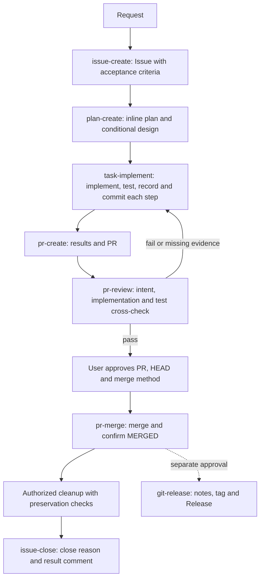

# git-workflow

**Carry one change from Issue intent to an approved merge on the same evidence.**

**English** · [한국어](README.ko.md)

git-workflow is a Codex and Claude Code plugin for Issue-based changes. It records what the requester wants as Issue acceptance criteria, keeps the execution plan in the Issue and creates separate work files only when needed, and carries those IDs through implementation, tests, the PR and review. Each stage reads the previous stage's intent and actual results instead of a summary from memory.

The plugin is a set of instructions, not a CI service. One chat can coordinate the workflow. A session that writes or reads independent review criteria or inputs cannot implement that change; use a separate implementation session.

## Why

- **Intent and evidence stay connected** — acceptance criteria IDs connect the inline plan, test cases, PR results and review.
- **Reviews cross-check for missing tests** — pr-review maps every acceptance scenario to its implementation and its assertion, and reports scenarios with no test.
- **Each risky step has its own approval** — commit, push, PR, merge, deployment and release are separate actions; approval for one does not extend to another or to a new HEAD.
- **Target repositories use the same forms** — workflow-init installs Issue and PR templates that contain the fields the skills require.

## Choose your next request

Start with the result you want. The router reads the Issue and recorded work to choose the next stage; you can also name a skill directly.

| Your situation | Example request | Skill |
| --- | --- | --- |
| New repository | “Install Issue and PR templates in this repository.” | workflow-init: templates |
| Adopt the workflow | “Propose a git-workflow declaration for AGENTS.md.” | workflow-init: AGENTS.md; explicit approval before the addition |
| New change | “Create an Issue for retry guidance; keep expired guidance unchanged.” | issue-create |
| Ready Issue | “Write the implementation plan for Issue #12.” | plan-create |
| Prepared step | “Implement step 01 of Issue #12 and record its tests.” | task-implement |
| Implementation ready | “Prepare the handoff and PR for Issue #12.” | pr-create |
| Review needed | “Review this PR against its Issue, plan and actual test evidence.” | pr-review |
| Reviewed HEAD | “Merge this approved PR using the agreed method.” | pr-merge; approval applies to that PR and HEAD |
| Work ended | “Close Issue #12 with its confirmed outcome and close reason.” | issue-close; closure and comments have their own scope |

Use commit-rule for a scoped commit, workflow-init for branch policy setup, and git-release for a release. Ordinary branch, PR and hotfix requests read and follow the [project policy](skills/git-workflow/references/project-branch-policy.md). These requests do not authorize the other actions automatically. The skill table below links to each rule.

The Issue owns the original request, behavior change, scope, constraints, AC, plan and required reference links. The PR owns actual implementation, verification and delivery results. Detailed plans and task contracts are conditional. Implementation does not receive private review inputs. See [document roles and handoff](skills/git-workflow/references/document-links.md).

## How it works


```mermaid
flowchart TD
    A[Request] --> B[issue-create: Issue with acceptance criteria]
    B --> C[plan-create: inline plan and conditional design]
    C --> D[task-implement: implement, test, record and commit each step]
    D --> E[pr-create: results and PR]
    E --> F[pr-review: intent, implementation and test cross-check]
    F -->|fail or missing evidence| D
    F -->|pass| G[User approves PR, HEAD and merge method]
    G --> H[pr-merge: merge and confirm MERGED]
    H --> J[Authorized cleanup with preservation checks]
    J --> K[issue-close: close reason and result comment]
    H -. separate approval .-> I[git-release: notes, tag and Release]
```

Cleanup reports remote branches, local branches and worktrees separately. Dirty, shared, locked, protected and post-review work is preserved. Codex managed worktrees use archive management. Read the [cleanup policy](skills/pr-merge/references/post-merge-cleanup.md). Closure comments belong to issue-close when installed; otherwise evidence remains in a local handoff. Small follow-up changes reuse an open Issue only when intent, scope and AC match; a different scope after closure needs a new linked Issue.

| Skill | Use it to |
| --- | --- |
| [git-workflow](skills/git-workflow/SKILL.md) | Start or resume an Issue-based change and choose the next stage |
| [workflow-init](skills/workflow-init/SKILL.md) | Initialize selected templates, AGENTS.md, labels, release categories and project branch policy |
| [issue-create](skills/issue-create/SKILL.md) | Write or complete an Issue, check for duplicates first |
| [plan-create](skills/plan-create/SKILL.md) | Write an inline Issue plan and conditional detailed design |
| [task-implement](skills/task-implement/SKILL.md) | Implement the prepared plan, verify and record results, and make approved commits |
| [pr-create](skills/pr-create/SKILL.md) | Record AC results and verification evidence, and open the PR |
| [pr-review](skills/pr-review/SKILL.md) | Check that the change meets the Issue intent and that no test is missing |
| [pr-merge](skills/pr-merge/SKILL.md) | Confirm the approved merge, safely clean up the work and hand off closure evidence |
| [issue-close](skills/issue-close/SKILL.md) | Close an Issue with a close reason and a result comment |
| [commit-rule](skills/commit-rule/SKILL.md) | Make scoped commits and write commit messages |
| [git-release](skills/git-release/SKILL.md) | Prepare release notes, tags and GitHub Releases |

Simple work uses the Issue and PR as its records. Create a plan only when [detailed design is needed](skills/plan-create/references/plan.md#상세-plan-생성-조건); add task contracts only for independent handoffs. Handoff, review, evidence and txt files are not automatic outputs. Follow the [evidence lifecycle and document hub handoff](skills/git-workflow/references/document-links.md), preserve existing records and fixed links, and use the [short example](docs/examples/issue-centered-records/README.md). Freeze independent criteria before implementation and keep them in a [review-only location](skills/plan-create/references/review-criteria.md#보관-위치).

## spec-it

[spec-it](https://github.com/insung/spec-it) is a separate plugin that pins a project's architecture and product policies. A project adopts it by committing `.architecture/manifest.yaml` and `.architecture/lock.yaml`. git-workflow does not require spec-it.

| Project state | pr-review behavior |
| --- | --- |
| Adopted (manifest and lock present) | Runs the intent, implementation and test cross-check, then applies the [spec-it policy check](skills/pr-review/references/spec-it-policy.md) against the pinned rules and records verdicts by rule ID |
| Not adopted | Runs the intent, implementation and test cross-check only, records "spec-it not adopted", and makes no policy verdict |

## Installation

### Claude Code

```sh
claude plugin marketplace add insung/git-workflow
claude plugin install git-workflow@git-workflow
```

### Codex

```sh
codex plugin marketplace add insung/git-workflow
codex plugin add git-workflow@git-workflow
```

Start a new session after installing or updating. In Claude Code the skills appear as `/git-workflow:<skill>`.

### First run in a target repository

Use [workflow-init](skills/workflow-init/SKILL.md) to select templates, an AGENTS.md declaration, GitHub labels, release categories, or a project branch policy. Broad installation requests wait for selection; explicit partial requests apply only those items. Labels preview differences before approved missing-only creation; existing release settings are preserved.

The branch-strategy skill has been removed. Replace old setup calls with workflow-init’s branch policy option, and use ordinary branch requests with the shared policy reader for branch operations. Existing project policy documents are preserved.

Branch policy is an independent option. Start from existing practice, then compare GitHub Flow, Trunk, Release Flow, Gitflow and the existing dev/prod option. Record the approved policy in one project document and propose a minimal AGENTS.md reading link. Changes to existing README content need separate approval; reread files before writing and renew approval if they changed. Document creation alone does not prove AI compliance: check ordinary branch, PR and hotfix requests. See [policy setup](skills/workflow-init/references/branch-policy.md) and [options with official sources](skills/workflow-init/references/branch-options.md).

Ask the agent to install the GitHub templates, for example "Install the git-workflow Issue and PR templates in this repository". Selecting template installation/update, or explicitly requesting template installation or update, installs missing files and replaces existing contents with the complete canonical templates. Requests to preserve existing contents or only inspect differences do not replace them. It keeps existing names and locations and skips byte-identical files. When a local workspace is specified, it uses that source rather than the installed plugin cache.

Ask "Initialize this project’s AGENTS.md for git-workflow" to use [workflow-init](skills/workflow-init/SKILL.md): it proposes a declaration for an individual project or a root containing multiple projects, then adds it only after explicit approval while preserving existing bytes. The declaration makes the main agent coordinate approved stages and independently validate a separate implementer’s work; see the skill for the declaration and the [role-specific reading order](skills/git-workflow/references/document-links.md#문서별-역할과-읽기-순서) for shared context and handoff.

## Architecture

```text
skills/
├── git-workflow/      router, execution boundaries, conventions, labels, links
├── issue-create/      Issue content rules
├── plan-create/       inline plan and optional design forms
├── task-implement/    plan implementation and result recording rules
├── pr-create/         PR rules and handoff form
├── pr-review/         review form and spec-it policy check
├── pr-merge/          approved merge
├── issue-close/       close reasons and closing comment form
├── commit-rule/       commit message and scope rules
├── git-release/       release notes
└── workflow-init/     selected setup, canonical assets and label tool
```

Each rule has one canonical file. SKILL.md files link to their references instead of repeating them.

## Development

Requirements: Node.js 18 or newer. No dependencies.

```sh
node --test tests/package.test.mjs
node scripts/check-package.mjs
claude plugin validate .claude-plugin/plugin.json
claude plugin validate .claude-plugin/marketplace.json
git diff --check
```

These checks cover package structure, manifests, required files and relative links. They do not measure skill selection or review quality; skill changes are checked with before-and-after scenarios, run as defined in [verification runners](skills/git-workflow/references/execution-boundaries.md#검증-실행-주체).

## Examples

The [examples](docs/examples/README.md) show filled document sets and flows. The [before-and-after records](docs/examples/readable-records/README.md) show how to preserve meaning while making the conclusion and next action easier to find.

| Example | Flow |
| --- | --- |
| [git-workflow v0.3.0 (real case)](docs/examples/git-workflow-v0.3.0/README.md) | Review, Issue, plan with comments, fixed review criteria, separate implementation session, independent review, merge and release |
| [Python version upgrade](docs/examples/python-version-upgrade/README.md) | Issue, plan, step todos, handoff, PR and review |
| [Resume an existing Issue](docs/examples/resume-existing-issue/README.md) | Continue another session's work from its documents |
| [Review rework](docs/examples/review-rework/README.md) | Fix review findings and review the new HEAD |
| [Crawler startup hotfix](docs/examples/crawler-startup-hotfix/README.md) | Fix from prod and reflect the fix into dev |
| [Production release](docs/examples/production-release/README.md) | dev to prod, deployment and release notes |
| [Local pilot](docs/examples/python-version-upgrade/local-pilot.md) | Prepare documents without GitHub access |

## License

[MIT](LICENSE)
