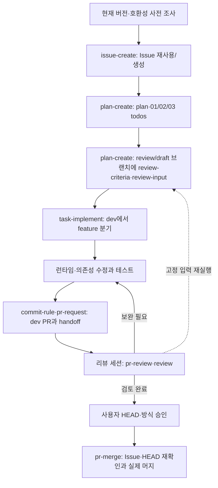

# 파이썬 버전 업그레이드 / Python version upgrade

> dmp.crawler 프로젝트 파이썬 버전 업그레이드가 필요해. issue-create와 plan-create로 준비하고 진행해줘.

목표 버전·현재 버전·파일 경로·배포 환경은 미확인 상태로 둔다.

| 문서 | 작성 시점과 용도 |
| --- | --- |
| [issue.md](issue.md) | 의도·영향 범위·달성 조건을 원격 Issue에 요약할 초안 |
| [plan.md](plan.md) | Issue 기반 맥락·작업 순서·검증·배포/롤백 계획 |
| [task-01-runtime-compatibility.md](task-01-runtime-compatibility.md) | 현재 실행 경로와 목표 버전 호환성 조사 |
| [task-02-runtime-upgrade.md](task-02-runtime-upgrade.md) | 런타임·의존성 구현과 테스트 |
| [task-03-release-handoff.md](task-03-release-handoff.md) | 배포 준비·PR 인계·독립 검토 |
| [review-criteria.md](review-criteria.md) | 구현 전에 `review/draft-python-version-upgrade` 브랜치에 고정하는 AC별 판정 기준. 작업 디렉토리에는 pr-review의 기록 커밋 뒤에 나타남. [보관 위치](../../../skills/git-workflow/references/review-criteria.md#보관-위치) |
| [review-input-runtime-compat.md](review-input-runtime-compat.md) | TC-02를 pr-review가 다시 실행하는 고정 입력. review-criteria.md와 같은 브랜치·같은 반입 시점 |
| [handoff.md](handoff.md) | 실제 구현 커밋·테스트 결과를 리뷰 세션에 인계 |
| [pr.md](pr.md) | 실제 Issue 연결과 변경/검증 요약·docs 링크 |
| [review.md](review.md) | 검토 HEAD·의도·정책·테스트 근거 판단 |
| [local-pilot.md](local-pilot.md) | 실제 변경 없이 또는 로컬 초안만 작성해 시험하는 요청 |

plan의 `issue: null`은 원격 Issue가 없는 [로컬 파일럿](../../../skills/issue-create/references/plan.md#로컬-파일럿-디렉토리-규칙) 상태다. 목표 버전 결정 전 영향받는 구현 단위는 보류한다.
