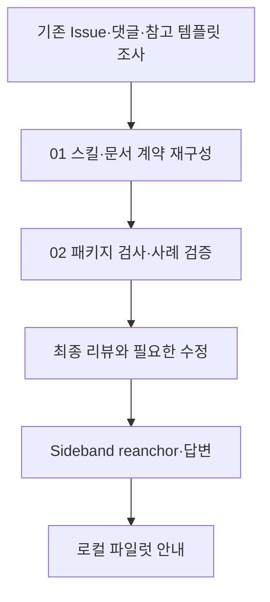

# Git Workflow 문서 계약 Implementation Plan

> **For agentic workers:** REQUIRED SUB-SKILL: Use superpowers:executing-plans to implement this plan task-by-task. Steps use checkbox (`- [ ]`) syntax for tracking.

**Goal:** Issue → 계획/todo → 구현·테스트·커밋 → PR → spec-it 리뷰 → 승인·머지·Wiki 흐름을 현재 세션에서도 실행 가능한 지시 패키지로 제공한다.

**Architecture:** 공통 규칙은 라우터의 references에, 단계별 상세와 양식은 해당 스킬에 둔다. 원격 기록은 요약·문서 링크로 연결하고, 실제 실행 증거와 승인을 다음 단계에 전달한다.

**Tech Stack:** Markdown, JSON manifests, Node.js 18+ built-in tests, GitHub CLI.

**Spec:** [design.md](design.md)

## Global Constraints

- 외부 의존성과 실행기 추가 없음; 후보 버전 0.2.0 유지
- .comments는 공식 Sideband 스크립트만 사용; 다른 세션 변경 보존
- 설치 캐시·spec-it 정본·참고 track 원본 변경 없음
- 미실행 테스트·발행·배포·원격 URL을 사실로 기재하지 않음
- 이번 작업은 커밋·push·원격 게시 없이 로컬 파일럿 후보로 전달

## 맥락과 사용자 의도

Issue에서 시작해 원래 요청과 배경을 잃지 않고 구현·검증 역할이 문서로 인계되기를 원한다. 기존 단일 스킬을 부르기 쉬운 단계로 나누고, AI가 핵심 요소를 빠뜨리지 않도록 예제와 상세 양식을 보강한다. GitHub 인증 실패로 [기존 로컬 Issue 초안](../../../issues/2026-10-01-issue-review-workflow.md)을 이어 사용하며 원격 Issue 번호는 없다.

## Review Focus

- 긴급 요청이어도 Issue 의도·plan/todo·검증/배포 계획을 생략하지 않는다.
- 완료 체크박스와 실제 commit·테스트 identity가 다르면 현재 HEAD 통과로 쓰지 않는다.
- 라벨 조회 실패는 라벨 부재가 아니다. 생성 실패 시 중복 실행/기존 라벨 덮어쓰기를 하지 않는다.
- 문서가 로컬에만 있으면 외부 사용자가 읽을 수 있는 링크로 주장하지 않는다.
- 머지·배포·Wiki는 별도 상태로 추적하며 auto-merge 등록을 완료로 쓰지 않는다.

## 실행 흐름

## 01 스킬과 문서 계약

**Files:** skills/git-workflow/SKILL.md와 references/{change-conventions,writing-conventions,labels,document-links}.md; skills/{issue-create,pr-create,pr-review,pr-merge,commit-rule,git-release}/; README.md, README.ko.md; docs/workflow.md.

**Interfaces:** 준비된 Issue와 plan/todo → 구현·테스트·commit 인계 → 검토 identity/status → 승인된 PR/HEAD와 Wiki 상태.

구체 작업과 근거는 [01-todos.md](01-todos.md)에 기록한다. baseline 읽기 전용 시나리오를 먼저 관찰하고 각 변경 계약에 대해 같은 시나리오를 확인한다.

## 02 구조 검사와 회귀·인계

**Files:** scripts/check-package.mjs, tests/package.test.mjs, .gitignore, skills/git-workflow/agents/openai.yaml, docs/testing/, 현재 디렉토리 validation.md.

**Interfaces:** `validatePackage(root: string): string[]` 유지. 정식 스킬 9개와 필요한 reference 계약을 검사한다. 테스트 fixture는 실제 누락을 만들어 거부를 assert한다.

구체 작업은 [02-todos.md](02-todos.md)에 기록한다. RED로 새 구조 fixture를 기존 검사기에 실행한 후 검사기를 갱신한다.

## 검증 계획

단위 테스트와 패키지 실제 검사, Claude plugin/marketplace manifest, git diff --check, ignore 확인, 새로운 문서와 상대 링크를 확인한다. 별도 읽기 전용 에이전트로 기존/새 지시 시나리오 및 최종 검토를 수행한다. 모델의 실제 장기 준수나 원격 운영을 증명하지 않는다.

## 배포·전달 및 롤백 계획

이 후보는 서버 배포가 없다. 소스 파일을 지정한 새 세션 파일럿으로 전달한다. 설치 갱신은 추후 커밋·push·플러그인 업데이트와 새 세션 discovery 확인이 필요하며 이번에는 수행하지 않는다. 발행 승인 후에는 동일 버전의 설치 캐시 문제를 피하도록 후보 릴리즈 버전을 확정한다. 문제 발생 시 작업본 diff를 검토해 이 세션 변경만 되돌리는 계획을 세우며 전체 reset/clean은 사용하지 않는다.

## 결정·진행 기록

- 상태: 로컬 후보 구현·검증 완료. 미커밋·미발행이며 실제 호스트·원격 실행은 미검증.
- 사용자 요청에 따른 로컬 수정은 승인되어 있으므로 계획 승인 재질문 없이 실행한다.
- 검증 결과와 미확인은 [validation.md](validation.md)에 기록한다.

## 후속 보완: 스킬 트리거와 계획 분리

- skill-creator 기준으로 8개 SKILL.md의 한글 description에 적용 요청을 명시하고 본문에 사용 조건 보완
- issue-create는 Issue 작성, plan-create는 계획·todo 작성으로 역할 분리
- 실제 Issue 번호 경로, plan 프런트매터, 작업과 검증 중심의 nested todo 예제 적용
- 이동된 옛 파일과 호환 안내 삭제, Sideband 답변 이벤트 보존
- 검증: 각 스킬 quick_validate, 변경된 누락 경로 fixture, 패키지/로컬 링크/manifest 검사
- 전달: 이 소스 파일로 로컬 시험; 발행과 원격 게시·머지는 현재 요청에 포함하지 않음

## 후속 보완: Issue 연결과 커밋 범위

- pr-create와 pr-merge는 공통 Issue 연결 계약으로 PR 본문의 참조·실제 Issue 종류·의도/영향/AC를 대조한다. 머지에서는 최종 리뷰와 사용자 승인도 각각 확인한다.
- 기존 staged 변경과 소유권을 분리하고 출처 불명도 scope를 읽는 조건으로 추가한다. 메시지·범위 리뷰와 코드 리뷰의 스킬 선택을 구분한다.
- 기능·버그 Issue 템플릿을 별도 정본 파일로 추출하고 plan의 Issue 값을 하나의 문자열로 단순화한다. 상태 enum은 plan reference에서만 정의한다.
- 안내 문서는 플러그인의 기능과 실행 계약에 집중한다. 설치 좌표는 유지한다.
- 검증·전달: skill-creator와 패키지 검사, 로컬 파일럿 시나리오 안내 갱신; 실제 원격 실행과 발행은 수행하지 않는다.

## 후속 보완: 브랜치 전략·중복·가독성

### 맥락과 의도

사용자는 dev 기반 feature 작업, prod 운영 배포와 hotfix 역반영을 독립된 스킬로 정의하려 한다. 개별 스킬의 범위를 좁히고 공유 규칙을 한 곳에서 관리하여 중복·모호한 요청 조건·설치 의존성을 줄인다.

### 작업과 흐름

- branch-strategy로 브랜치 정의·분기 안내를 분리하고 확인된 dev/feature/prod/hotfix 및 릴리즈 태그 흐름을 기록
- 공통 실행 경계를 작은 reference로 추출하고 작업 경로 규칙은 plan reference로 연결
- 작업 문서를 draft 경로로 이동하고 참조 링크 갱신
- spec-it 설치/고정 소스 부재의 직접 조사·human-review 경로 정의
- PR 검증 요약과 상세 재현 절 구분, 예시와 README 언어·문장 정리
- Sideband 답변 후 9개 스킬과 패키지·manifest·로컬 링크 검증

### 검증과 전달

skill-creator 검사, 패키지 누락 fixture와 실제 소스 구조 검사를 적용한다. 자동 스킬 선택·실제 GitHub 실행은 별도 환경에서 확인해야 한다. 소스 파일을 지정한 로컬 시험으로 전달하며 커밋·push·설치 캐시 변경과 실제 브랜치 생성·이름 변경은 이번 범위에 포함하지 않는다.
