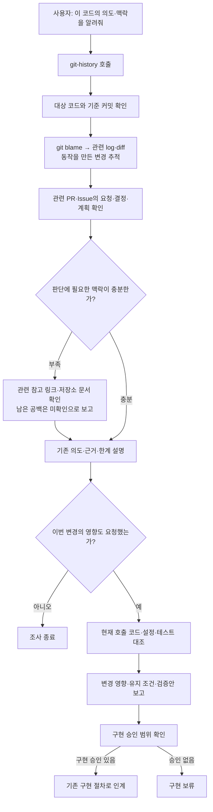

# 명시적으로 요청하는 코드 의도·변경 영향 조사

필요한 때 `git-history`에 코드의 의도·맥락 또는 제안된 변경 영향을 요청한다. AGENTS.md에는 호출 안내만 두고 상세 실행 지침은 스킬을 정본으로 유지한다. 모든 구현마다 전체 Git 이력 조사와 새 승인을 추가하는 방식은 아니다.

이 문서는 사용 목적과 흐름을 설명한다. [대표 사용 예시](../examples/code-context-investigation/README.md)는 요청과 보고의 차이를 보여주며, [git-history](../../skills/git-history/SKILL.md)는 실제 실행 지침이다. 변경 계약·사용자 요청 원문·설계 경과는 [Issue #60](https://github.com/insung/git-workflow/issues/60)에 있다.

## 언제 사용하는가

| 사용자 요청 예 | 사용자가 받는 결과 |
| --- | --- |
| 왜 이렇게 구현했는지 알려줘 / 이 코드의 의도를 알려줘 | 기준 동작을 만든 요청·선택 이유와 근거 설명 |
| 맥락을 알고싶어 / 이 함수가 지금 형태가 된 배경을 알려줘 | 최초 의도와 후속 변화 설명 |
| 이 조건은 언제, 어떤 요청으로 들어왔어? | 조건 도입과 관련 요청·결정의 연결 |
| 이 조건을 없애면 어디에 영향이 있어? | 현재 호출·설정·테스트에 대한 예상 영향·유지 조건·검증안 |
| 이 Issue의 승인된 계획대로 구현해줘 | 기존 구현 절차 진행; 자동 필수 조사 추가 없음 |

표현의 의미로 호출하며 정확한 문장 일치나 스킬명 암기를 요구하지 않는다. 의도 질문은 설명으로 끝나고, 영향 질문은 영향 보고로 끝난다. 실제 수정이 함께 승인돼 있다면 기존 승인 범위에서 구현 절차로 인계한다.

## 사용자가 보는 흐름

Git blame은 마지막 줄 변경의 단서이므로 그 커밋이 최초 의도라고 단정하지 않는다. 관련 log·diff로 동작 기원을 찾고 필요한 PR·Issue의 요청·결정과 연결한다. 직접 연결이 없으면 저장소 문서와 후보를 대조한다. 이력이 충분하면 종료하고 핵심 공백이나 접근 제한이 남으면 그 한계를 보고한다.

영향은 과거 PR의 파일 목록 대신 현재 코드를 기준으로 판단한다. 예측한 영향과 실제 실행 결과를 구별하므로 영향 보고만으로 테스트 통과·배포 성공을 주장하지 않는다. 명령 선택·원문 링크 확인·종료 기준·구현 인계의 상세는 [스킬 정본](../../skills/git-history/SKILL.md)과 영향 요청 때만 읽는 [변경 영향 참조](../../skills/git-history/references/change-impact.md)에 있다.

## AGENTS.md에서 발견하기

[workflow-init](../../skills/workflow-init/SKILL.md)의 AGENTS 항목은 다음 호출 안내를 제안한다.

> 코드의 의도·맥락 또는 변경 영향을 조사해 달라는 요청에는 git-history를 사용한다. 조사 결과와 근거를 설명하고, 구현은 승인된 범위에서 기존 워크플로우로 진행한다.

기존 내용·동일 의미 안내를 보존하며, 실제 적용은 [AGENTS 제안·승인 절차](../../skills/workflow-init/references/agents.md)를 따른다. 로컬 소스 변경만으로 설치된 플러그인이나 기존 프로젝트 AGENTS가 갱신되지는 않는다.

## 설계 경과와 효과의 한계

조사·계획·승인을 구별하고 작업 크기에 따라 조사를 조절한 공개 경험은 설계 참고다. 이번 전체 흐름의 정확도 개선·비용 절감·재작업 감소를 실증한 근거는 제한적이다. 조사 시간·토큰과 관련 근거의 정확성, 불필요한 탐색·승인·구현의 발생 여부로 효과를 비교할 수 있으나 목표 수치와 개선 효과는 미측정이다. 사례 원문과 정적 검토 결과는 [Issue #60의 참고 링크와 구현 절차 검토](https://github.com/insung/git-workflow/issues/60)에 연결한다.

기존 공통 구현 절차의 부담 검토·정리는 별도 새 세션 범위다. 이번 조사 기능은 그 정리를 필수 선행으로 요구하지 않으며 공통 구현·실행 경계·독립 검토 절차를 개편하지 않는다.
