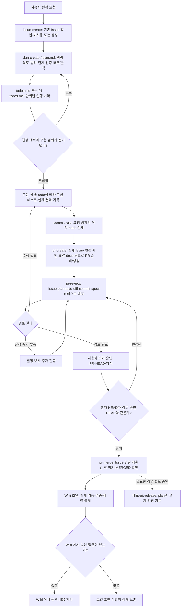

# Issue에서 Wiki까지 Git 워크플로우

git-workflow 플러그인은 Issue → 계획/todo → 구현·테스트·커밋 → PR → spec-it 리뷰 → 사용자 승인 → 머지 → Wiki를 연결한다. 현재 대화 세션 또는 별도 세션에서 같은 계약을 사용한다. 역할은 예시이며 이 패키지가 에이전트나 GitHub Actions를 자동 실행하지 않는다.

## 실행 흐름



GitHub 접근 불가면 local-draft로 로컬 파일럿만 진행한다. 원격 PR 생성 전 실제 Issue가 필요하다. 커밋 요청이 없으면 실제 미커밋 identity로 인계한다. Issue/PR 생성 요청은 머지·배포·Wiki 승인으로 확대되지 않는다.

## 문서 디렉토리

```text
docs/git-workflows/2026-10/01_123_retry-guidance/
├── plan.md          # 요청 맥락·사용자 의도·01/02 단계·검증·배포/롤백
├── 01-todos.md      # 오류 분류와 단위 검증
├── 02-todos.md      # 소비자 안내와 통합 검증
├── handoff.md       # 실제 구현·commit·테스트·계획 이탈
├── review.md        # 검토 HEAD·의도/정책 판단·부족한 증거
└── wiki.md          # 확인된 머지 이후 초안/발행 상태
```

위 디렉토리의 123은 가상 Issue 번호다. 작은 작업은 todos.md 하나로 묶어도 된다. 새 경로는 `docs/git-workflows/{yyyy-MM}/{dd}_{issue-number}_{title}/`이며 실제 Issue 생성·조회 후 확정한다. 생성 전 미래 번호를 예측하지 않는다. 원격 불가 파일럿은 `{dd}_draft_{title}`로 시작하고 실제 번호를 얻으면 자신이 만든 임시 디렉토리와 링크를 갱신한다. 기존 문서 구조와 연결은 유지한다. 새 작업에 사용하는 양식은 아래 정본을 읽고 대상 리포의 해당 디렉토리에 채운다.

## 스킬·양식과 필수 입력

| 단계 | 필수 조건과 결과 | 상세 양식의 정본 |
| --- | --- | --- |
| issue-create | 실제 Issue 또는 local-draft, 의도·영향·AC | [Issue 기준](../skills/issue-create/references/issue.md), [기능 템플릿](../skills/issue-create/references/feature-issue.md), [버그 템플릿](../skills/issue-create/references/bug-issue.md) |
| plan-create | 현재 동작·사용자 의도·단위 흐름·검증/배포·롤백, 구체 작업·하위 task·검증 checklist | [plan](../skills/plan-create/references/plan.md), [todos](../skills/plan-create/references/todos.md) |
| 구현·commit-rule | plan/todo 확인, 의미 있는 테스트 사례·실제 결과, 범위 분리·기존 index 보존, 실제 commit 또는 미커밋 identity | [구현 진행](../skills/git-workflow/SKILL.md#구현-진행), [commit-rule](../skills/commit-rule/SKILL.md), [scope](../skills/commit-rule/references/scope.md) |
| pr-create | 실제 Issue와 구현 결과, plan/todo/commit·검증 근거, 계획 이탈·위험, 실제 Issue 연결 확인·승인된 원격 쓰기 | [PR](../skills/pr-create/references/pr.md), [handoff](../skills/pr-create/references/handoff.md) |
| pr-review | 원래 의도→AC/todo→commit·실제 diff→테스트 증거, 정확한 spec-it pin, 배포/롤백 조건과 실제 상태 | [review](../skills/pr-review/references/review.md) |
| pr-merge | 실제 Issue 연결·의도/영향/AC와 검토 결과 대조, 검토한 HEAD와 사용자 승인, 실행 시 HEAD 일치, 실제 머지 확인 후 Wiki 기록 | [pr-merge](../skills/pr-merge/SKILL.md), [Wiki](../skills/pr-merge/references/wiki.md) |
| git-release | 실제 제품/배포 단위·base/target·diff·소비자 영향, 발행 승인과 원격 확인 | [릴리즈 노트](../skills/git-release/references/release-notes.md) |

공통 [type·scope](../skills/git-workflow/references/change-conventions.md)와 [문체](../skills/git-workflow/references/writing-conventions.md)는 각 단계에서 읽고 복제하지 않는다. plan의 Issue·상태·기준 커밋은 프런트매터에 기록한다. status 값은 [plan 정본](../skills/plan-create/references/plan.md#메타데이터와-상태)에서 정의한다. 승인 범위는 실제 요청을 따르며 별도 메타데이터를 반복 관리하지 않는다. todo는 해당 계획 섹션에 연결하고 작업별 하위 task와 검증에 집중하며, 상세 실행 증거는 handoff에 연결한다. AI 작성 커밋의 푸터에는 실제 도구의 `Agent: Codex` 또는 `Agent: Claude`를 남긴다. plan/todo는 추적 가능한 공유 기록이며 .superpowers/의 임시 실행 파일과 다르다.

## 검증의 책임과 증거

구현 담당이 테스트 사례와 의미 있는 assertion을 만든다. 단위별 검증 또는 최종/별도 세션 검증을 계획에서 선택하고 이유·환경·명령·담당을 기록한다. 미실행은 not-run이다. 최종 통합/회귀와 독립 검토 결과가 남아 있으면 전체 검증 완료로 표시하지 않는다.

| TC/AC | 사례 | 기대 | 실제·상태 | 실행 근거 |
| --- | --- | --- | --- | --- |
| TC-01 / AC-01 | 일시 오류 | 재시도 가능한 안내 | not-run | 실행 후 명령/cwd·revision·환경·시각 기록 |
| TC-02 / AC-01 | 만료 오류 | 재시도 권유 없음 | not-run | 실행 후 기록 |

위 표는 가상 사례다. 리뷰 담당은 체크박스나 구현자의 pass를 신뢰하는 대신 테스트 파일·assertion·실제 결과·검토 HEAD와의 관계를 대조한다. 문서 전용 등 unit test 제외 시 이유와 대체 검사도 확인한다. 정책 manifest/lock이 없으면 shadow assessment, 규칙·결정·증거 부족은 human-review로 남긴다. spec-it은 해당 프로젝트의 pinned 기준을 사용하고 미채택 규칙을 새 의무로 만들지 않는다.

## PR 생성·머지의 Issue 연결

[Issue 연결 검사](../skills/git-workflow/references/issue-link.md)를 공통 기준으로 적용한다. PR 본문에는 Issue 항목과 해결 범위 요약을 남긴다. 같은 저장소는 #번호, 다른 저장소는 owner/repository#번호 또는 전체 Issue URL을 쓴다. 실제 Issue 여부와 의도·영향·AC가 이번 PR에 대응하는지 확인하고, 머지 시에는 최종 검토 결과까지 대조한다. 잘못된 참조·누락·접근 불가·내용 불일치이면 보류한다. local-draft는 대신할 수 없으며 closed 여부만으로 실패 처리하지 않는다. 검사 통과와 사용자 머지 승인은 별개다.

“커밋 검토”의 메시지·범위·분리는 commit-rule, 코드 동작·의도·정책·테스트는 pr-review를 적용한다. 기존 staged 변경이나 출처 불명도 scope 참조를 읽는 조건이며 staged 여부로 작성자를 추정하지 않는다.

## Issue/PR에 남기는 기록과 라벨

상세 문서는 docs/에 두고 원격에는 결과·판단·남은 일의 핵심 요약과 확인된 문서 링크만 남긴다. 초기 Issue에는 계획 링크 준비 중이라고 적고 실제 commit/push·접근 확인 뒤 갱신할 수 있다. 미추적 문서의 GitHub URL을 만들어 붙이거나 전문 복사로 대신하지 않는다. [문서 링크 계약](../skills/git-workflow/references/document-links.md)을 따른다.

라벨은 [현재 저장소 분류](../skills/git-workflow/references/labels.md)를 우선한다. 예: 기능 Issue enhancement, 문서 PR documentation, 테스트 증거 부족이면 needs-tests, 결정 부족이면 needs-decision. 필요한 라벨이 없고 생성 범위와 write 권한이 있으면 만들 수 있다. 전체 목록 생성이나 기존 라벨 강제 갱신은 하지 않는다. 조회/생성 불가이면 상태를 보고하고 필수 자동화 라벨이면 초안으로 남긴다. [GitHub 공식 문서](https://docs.github.com/en/issues/using-labels-and-milestones-to-track-work/managing-labels)는 라벨의 저장소 단위 관리와 생성/적용 권한을 설명한다.

## 실행 방식과 한계

요청한 시나리오는 현재 대화 세션부터 적용 가능하다. 역할을 별도 세션으로 옮길 때도 같은 Issue·plan/todo·commit·검증 identity를 전달하면 된다. 다만 지시 문서만으로 AI의 무오류나 단계별 강제 실행을 보장하지 않는다. 실제 강제가 필요하면 별도 CI·보호 규칙·검증 runner가 필요하며 이 패키지 범위에는 없다.

이 플러그인은 대상 저장소의 계획 승인 규칙과 이미 주어진 사용자 승인을 따른다. 매 단계 동일한 승인을 다시 요구하지 않는다. 배포 계획이 있다는 사실도 실제 배포 승인이 아니다.

## 로컬 후보 시험과 상태

[로컬 시험 안내](testing/local-pilot.md)에서 소스 파일을 직접 지정한다. 미발행 로컬 변경은 기존 설치 캐시에 자동 반영되지 않는다. [이번 구현 계획](git-workflows/2026-10/01_workflow-contracts/plan.md)과 [검증 결과](git-workflows/2026-10/01_workflow-contracts/validation.md)에 실제 확인과 미확인을 구분한다.
